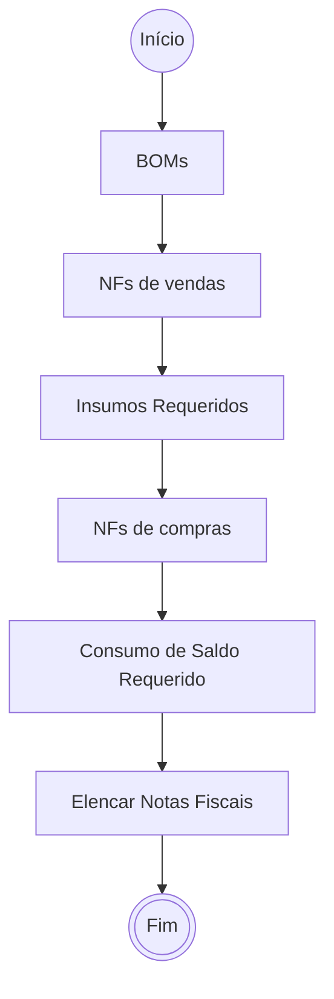
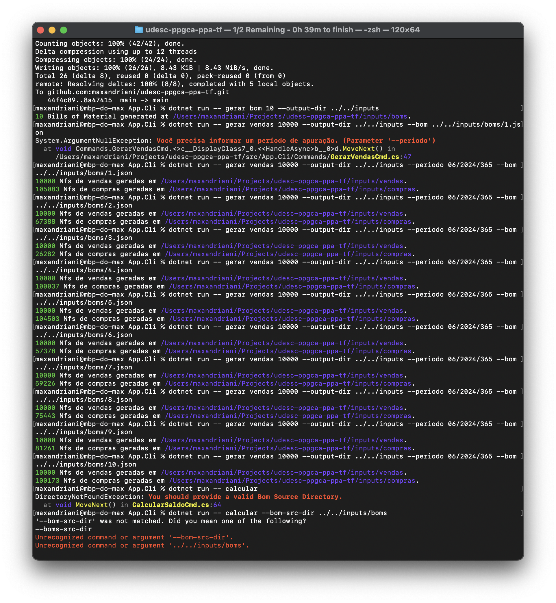
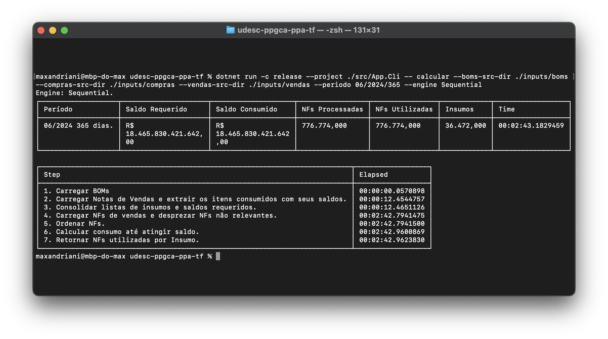
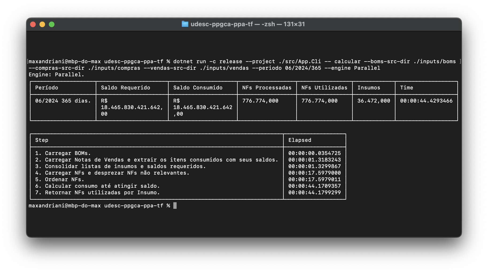

# Conversão de um cálculo de consumo de estoque sequencial para paralelismo com memória compartilhada

Para este exercício utilizou-se um problema hipotético de consumo de saldo de um estoque de insumos com base em um conjunto de notas fiscais de venda e um documento de detalhamento técnico de engenharia (Bills of Material). Em resumo, com base nas notas fiscais de vendas são estabelecidos os produtos vendidos no mês e suas respectivas quantidades. Depois consulta-se a relação de BOMs para computar a lista consolidade de insumos requeridos para fabricação dos produtos (Saldo Requerido). Por fim, são processadas as notas fiscais de compras dentro do período fiscal a fim de discriminar quais notas atendem o consumo de determinado produto vendido. As notas fiscais de compra devem ser consumidas na sequência em que foram emitidas, First In, First Out.

## Algorítimo

Foram elencadas sete etapas para correta execução deste algorítimo, sendo elas:

1. Carregar Bills of Materials em memória.
2. Carregar Notas Fiscais de venda de produtos do mês de apuração.
3. Consolidar listas de insumos e saldos requeridos.
4. Carregar Notas Fiscais de compras no período do regime e desprezar documentos que não estão relacionados com os insumos elencados.
5. Ordenar Notas Fiscais de compras pela data de emissão.
6. Calcular consumo do saldo requerido e abortar quando atingir o valor.
7. Retornar um relatório com a lista discriminada de Notas Fiscais de compras necessárias para justificar a produção das vendas do período.

## Equipamento

- BenchmarkDotNet v0.13.12, macOS Sonoma 14.5 (23F79) [Darwin 23.5.0]
- Apple M3 Pro, 1 CPU, 12 logical and 12 physical cores
- .NET SDK 8.0.302
- [Host]     : .NET 8.0.6 (8.0.624.26715), Arm64 RyuJIT AdvSIMD
- Job-FXTFVM : .NET 8.0.6 (8.0.624.26715), Arm64 RyuJIT AdvSIMD

## Inputs

Para simular uma carga de dados real, foi elaborado um volume de documentos similar a um caso de uso de referência.

- 10 Bills of Material (10 Tipos de produtos).
- 100.000 Notas Fiscais de Vendas distribuídas em 30 dias (Um período de apuração).
- 776.774 Notas Fiscais de Compras de insumos distrubuídas em um intervalo de 365 dias.
- 36.472 Insumos distintos distribuídos como materiais de 10 Produtos.
- 1.3GB de dados brutos.

## Resultados

| Algorítimo | Tempo Médio | Erro Amostral | Desvio Padrão | Razão |
| --: | --: | --: | --: | --: |
| Sequencial | 02m 52s | 1,291s | 1,144s | --- |
| Paralelo | 42s | 0,238s | 0,186s | 3,57x |

| Algorítimo | Alocação | Gen0 | Gen1 | Gen2 | Razão |
| --: | --: | --: | --: | --: | --: |
| Sequencial | 1,95 GB | 242.000 | 61.000 | 6.000 | --- |
| Paralelo | 2,12 GB |  252.000 | 71.000 | 6.000 | 9% Pior |

## Conclusão

1. **Performance (Tempo médio)**: A implementação paralela é significativamente mais rápida, cerca de 3,6x mais rápida que sua versão sequencial.
2. **Erro e Desvio Padrão**: As taxas de erro e desvio padrão foram relativamente baixas, o que indica a estabilidade da mensuração de performance entre as iterações.
3. **Alocação de Memória**: O algorítimo paralelo consumiu cerca de 9% mais memória, provavelmente devido a sobrecarga do paralelismo.
4. **Garbadge Collector**: Ambos os modelos apresentaram pressões de alocação similares na Gen0 e Gen1. A presença de um volume substancial de dados na Gen2 indica possibilidade de otimização de alocação ao remover objetos de longa duração.
5. **Lock Connections**: O modelo paralelo apresentou 2382 threads e produziu 3289 eventos de retenção de lock. É um indicador de possibilidade de otimização em remover uso de recursos conflitantes.
